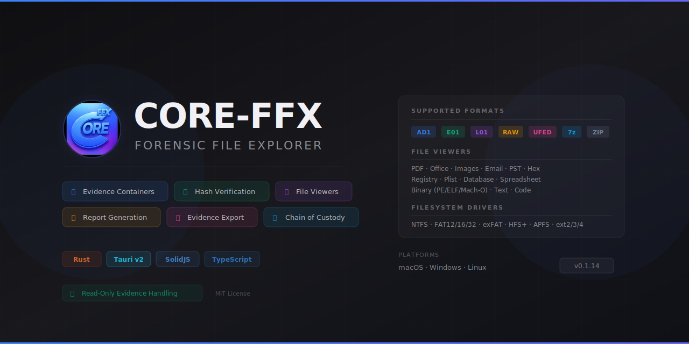

<p align="center">
  
</p>

# CORE-FFX — Forensic File Explorer

CORE-FFX is a professional-grade forensic file explorer built with **Tauri v2** (Rust backend) and **SolidJS** (TypeScript frontend). It focuses on evidence discovery, container metadata, verification workflows, and report generation while maintaining strict **read-only** evidence handling.

## Highlights

- 📁 Evidence directory scanning with streaming discovery
- 🔍 Container metadata, segment awareness, and integrity verification
- 🔬 Hex/text viewers with container-aware navigation
- 📄 Universal file viewers (PDF, images, email, binaries, spreadsheets, plists)
- 💾 Project files (`.cffx`) for session restore and audit continuity
- 🗄️ Processed database discovery (AXIOM parsing; additional detectors)
- 📊 Report generation (PDF, DOCX, HTML, Markdown)
- 🔌 Extension registry for custom parsers, viewers, and exporters

## Format Support

### Fully Parsed Containers

| Format | Extensions | Capabilities |
|--------|------------|--------------|
| AD1 | `.ad1`, `.ad2`… | Tree browsing, extraction, hash verification |
| E01/Ex01 | `.E01`, `.Ex01` | Segment verification, metadata extraction |
| L01/Lx01 | `.L01`, `.Lx01` | Logical image parsing |
| Raw Images | `.dd`, `.raw`, `.img`, `.001` | Direct byte access, VFS mounting |
| UFED | `.ufd`, `.ufdr`, `.ufdx` | Mobile extraction parsing |
| Archives | `.zip`, `.7z`, `.rar` | Metadata + ZIP extraction |

### Universal File Viewers

| Category | Formats |
|----------|---------|
| Documents | PDF, DOCX, HTML, Markdown, Text |
| Images | PNG, JPEG, GIF, WebP, HEIC + EXIF metadata |
| Email | EML, MBOX |
| Binaries | PE (EXE/DLL), ELF, Mach-O |
| Data | Plist, JSON, XML, CSV, Excel, SQLite |

### Detected for Triage

These formats are detected during scans but have limited parsing:

- AFF/AFF4, VMDK, VHD, VHDX, QCOW2, ISO, DMG
- TAR, GZIP, XZ, BZIP2, ZSTD, LZ4

## Quick Start

```bash
# Install dependencies
npm install

# Run in development mode
npm run tauri dev

# Build for production
npm run tauri build

# Run tests
cd src-tauri && cargo test   # Rust
npx vitest                   # Frontend
```

## Project Structure

```text
CORE-FFX/
├── src/                        # Frontend (SolidJS + TypeScript)
│   ├── components/             # UI components
│   ├── hooks/                  # State management + Tauri bridge
│   ├── styles/                 # CSS design system
│   │   └── variables.css       # Design tokens
│   ├── types/                  # TypeScript definitions
│   └── report/                 # Report generation UI
├── src-tauri/                  # Backend (Rust + Tauri v2)
│   └── src/
│       ├── commands/           # Tauri IPC commands
│       ├── containers/         # Container abstraction layer
│       ├── viewer/             # File viewers
│       │   └── document/       # Content viewers (PDF, email, binary, etc.)
│       ├── ad1/, ewf/, ufed/   # Format-specific parsers
│       └── common/             # Shared utilities
├── docs/                       # Technical documentation
│   └── archive/                # Historical docs (dated)
└── .github/
    └── copilot-instructions.md # AI coding agent instructions
```

## Documentation

| Document | Purpose |
|----------|---------|
| [`CODE_BIBLE.md`](CODE_BIBLE.md) | Authoritative codebase map and glossary |
| [`HELP.md`](HELP.md) | Quick help reference |
| [`CONTRIBUTING.md`](CONTRIBUTING.md) | Developer workflow |
| [`src/styles/README.md`](src/styles/README.md) | Tailwind CSS styling guide |
| [`src-tauri/src/README.md`](src-tauri/src/README.md) | Backend module reference |
| [`src/components/README.md`](src/components/README.md) | Frontend component catalog |
| [`src/hooks/README.md`](src/hooks/README.md) | State management hooks |
| [`.github/copilot-instructions.md`](.github/copilot-instructions.md) | AI coding agent guidance |

## Architecture

```text
┌─────────────────────────────────────────────────────────────────┐
│                    Frontend (SolidJS + Vite)                    │
│  ┌─────────────┐  ┌─────────────┐  ┌─────────────────────────┐ │
│  │ Components  │  │   Hooks     │  │    Event Listeners      │ │
│  └──────┬──────┘  └──────┬──────┘  └───────────┬─────────────┘ │
│         │                │                      │               │
│         └────────────────┼──────────────────────┘               │
│                          │ invoke()                             │
├──────────────────────────┼──────────────────────────────────────┤
│                          ▼                                      │
│                    Backend (Rust + Tauri v2)                    │
│  ┌─────────────┐  ┌─────────────┐  ┌─────────────────────────┐ │
│  │  Commands   │  │ Containers  │  │   Viewer/Document       │ │
│  │   (IPC)     │  │ Abstraction │  │   (PDF, Email, etc.)    │ │
│  └─────────────┘  └─────────────┘  └─────────────────────────┘ │
│  ┌─────────────┐  ┌─────────────┐  ┌─────────────────────────┐ │
│  │ AD1 Parser  │  │ EWF Parser  │  │   UFED / Archive        │ │
│  └─────────────┘  └─────────────┘  └─────────────────────────┘ │
└─────────────────────────────────────────────────────────────────┘
```

## Key Principles

- **Read-Only Evidence** — Source files are never modified
- **Hash Verification** — Integrity checks against stored checksums
- **Progress Events** — Long operations emit streaming progress updates
- **Container Abstraction** — Format-agnostic API over specific parsers
- **Design Tokens** — CSS variables for consistent theming

## License

MIT License — See [`LICENSE`](LICENSE).

---

*Last updated: February 11, 2026*
