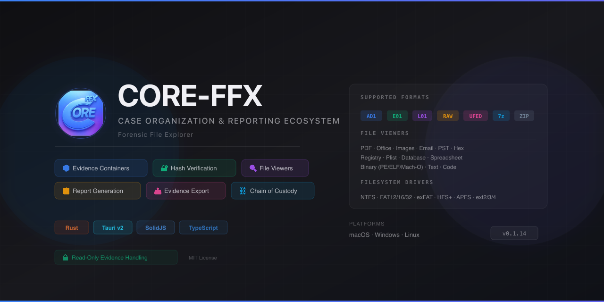

<p align="center">
  
</p>

# CORE-FFX

**CORE** — **C**ase **O**rganization & **R**eporting **E**cosystem  
**FFX** — **F**orensic **F**ile e**X**plorer

[](LICENSE) [](#installation) [](https://github.com/tmreyno/CORE/releases/latest)

---

## What Is CORE-FFX?

CORE-FFX is a cross-platform forensic file explorer for digital forensic examiners, incident responders, and law enforcement analysts. It provides a single workspace to **organize case data**, **explore evidence containers**, **verify integrity**, **collect and track evidence**, and **generate reports** — all while enforcing strict **read-only** access to source evidence.

Built with **Tauri v2** (Rust backend) and **SolidJS** (TypeScript frontend), CORE-FFX runs natively on macOS, Windows, and Linux with no cloud dependency. All evidence processing happens locally on the examiner's workstation.

---

## Key Capabilities

### Evidence Exploration

- **Recursive directory scanning** with streaming discovery of forensic containers
- **Unified evidence tree** with lazy-loaded browsing of AD1, E01, L01, Raw, UFED, and archive contents
- **Nested container support** — expand archives inside E01 images, ZIPs inside AD1 files, etc.
- **Virtual filesystem mounting** for raw disk images with partition and filesystem detection (NTFS, APFS, HFS+, ext2/3/4, FAT, exFAT)

### File Viewing

- **Hex viewer** with offset navigation and container-aware chunked reading
- **Universal file viewers** for PDF, Office documents (DOCX/PPTX/ODT/RTF), spreadsheets (Excel/CSV/ODS), images (with EXIF metadata), email (EML/MBOX/PST), Apple plists, Windows Registry hives, SQLite databases, and binary executables (PE/ELF/Mach-O)
- **Auto-detection** via file signatures when extensions are missing or misleading

### Hash Verification & Integrity

- **Multi-algorithm hashing** — MD5, SHA-1, SHA-256, SHA-512, SHA3-256/512, BLAKE2b/3, xxHash
- **Segment-aware hashing** that reads across multi-part containers (E01 + E02 + E03, etc.)
- **Stored hash comparison** against hashes embedded in E01/L01 headers and acquisition logs
- **Batch hashing** with pause/resume queue and progress tracking

### Forensic Image Creation & Export

- **E01 (Physical Image)** — create EnCase Expert Witness Format disk images via libewf, with compression, MD5/SHA1 hashing, case metadata, and segment splitting
- **L01 (Logical Image)** — create EnCase Logical Evidence containers with per-file hashes, directory hierarchy, compression, and multi-segment support (pure-Rust, no libewf dependency)
- **7z Archive** — create 7z archives with AES-256 encryption, split volumes, and configurable compression (LZMA SDK 24.09)
- **Native file export** — direct copy with optional SHA-256 verification, JSON manifest, and forensic report
- **Drive source selection** with optional read-only remount for forensic acquisition

### Case Organization

- **Project files** (`.cffx`) save and restore the full workspace — open tabs, evidence paths, session state, and case metadata
- **Per-project database** (`.ffxdb`) stores bookmarks, notes, tags, activity logs, hash records, export history, and search state
- **Case document scanning** — discover and catalog PDFs, Word documents, and other case materials
- **Bookmarks and notes** attached to evidence files with full-text search
- **Activity timeline** tracking examiner actions across sessions
- **Workspace profiles** for reusable directory configurations

### Evidence Collection & Chain of Custody

- **On-site evidence collection form** — schema-driven center-pane tab with auto-save and database persistence
- **Chain of custody tracking** with an append-only immutability model:
  - `draft` → freely editable
  - `locked` → amendments require initials and reason (creates audit trail)
  - `voided` → soft-deleted with reason, record preserved for audit
- **Linked data tree** showing relationships between collected items, COC records, and evidence files
- **COC audit log** capturing every insert, update, lock, amend, void, and transfer action

### Reporting

- **Report wizard** — 5-step guided workflow (Case Info → Evidence → Findings → Preview → Export)
- **Multiple output formats** — PDF, DOCX, HTML, Markdown
- **Customizable sections** with examiner details, evidence summaries, findings, and chain of custody

### Processed Database Integration

- **Auto-detection** of third-party forensic tool output (Magnet AXIOM, Cellebrite Physical Analyzer, Autopsy)
- **Case metadata parsing** — examiner names, data sources, artifact categories, search results
- **Dashboard view** for quick triage of processed database contents

### Project Management

- **Merge Projects Wizard** — combine multiple `.cffx` projects with examiner identification, deduplication, and full database merge across 35 tables
- **Auto-save** with configurable intervals
- **Project backup and versioning**
- **WAL checkpoint management** for database integrity on external media

### Software Updates

- **Built-in updater** — checks for new releases, downloads, and installs signed updates
- **Release notes** displayed in-app with formatted markdown rendering

---

## Supported Formats

### Forensic Containers (Full Parsing)

| Format | Extensions | Capabilities |
|--------|------------|--------------|
| AD1 | `.ad1`, `.ad2`… | Tree browsing, extraction, hash verification |
| E01/Ex01 | `.E01`, `.Ex01` | Segment verification, VFS, metadata extraction |
| L01/Lx01 | `.L01`, `.Lx01` | Logical image parsing, VFS |
| Raw Images | `.dd`, `.raw`, `.img`, `.001` | Direct byte access, VFS mounting, filesystem parsing |
| UFED | `.ufd`, `.ufdr`, `.ufdx` | Mobile extraction parsing |
| Archives | `.zip`, `.7z`, `.rar`, `.tar`, `.gz`, `.iso`, `.dmg` | Browsing, metadata, extraction |

### File Viewers

| Category | Formats |
|----------|---------|
| Documents | PDF, DOCX, DOC, PPTX, PPT, ODT, ODP, RTF, HTML, Markdown, Text |
| Images | PNG, JPEG, GIF, WebP, HEIC, BMP, TIFF + EXIF metadata |
| Email | EML, MBOX, PST |
| Spreadsheets | XLSX, XLS, CSV, ODS |
| Data | Plist, JSON, XML, SQLite, Windows Registry hives |
| Executables | PE (EXE/DLL), ELF, Mach-O — headers, sections, imports, exports |
| Forensic DBs | Magnet AXIOM, Cellebrite, Autopsy |

### Detected for Triage

Identified during scans with basic metadata but limited deep parsing:

AFF/AFF4, VMDK, VHD, VHDX, QCOW2, ISO, DMG, TAR, GZIP, XZ, BZIP2, ZSTD, LZ4

---

## Installation

### Pre-built Installers

Download the latest release for your platform from the [Releases page](https://github.com/tmreyno/CORE/releases/latest):

| Platform | Format |
|----------|--------|
| macOS (Apple Silicon) | `.dmg` (signed and notarized) |
| Linux (x64) | `.deb`, `.AppImage` |
| Windows (x64) | `.exe` (NSIS), `.msi` |

### Build from Source

Requires Node.js 18+, Rust stable toolchain, and [Tauri prerequisites](https://v2.tauri.app/start/prerequisites/) for your platform.

```bash
git clone https://github.com/tmreyno/CORE.git
cd CORE
npm install
npm run tauri build
```

### Development

```bash
npm install
npm run tauri dev          # Hot-reload development mode

cd src-tauri && cargo test # Rust backend tests
npx vitest                 # Frontend tests
```

---

## Architecture

CORE-FFX uses a two-process architecture: a Rust backend handles all file I/O, parsing, hashing, and database operations; a SolidJS frontend renders the UI and communicates with the backend over Tauri's IPC bridge.

```text
┌─────────────────────────────────────────────────────────────────┐
│                    Frontend (SolidJS + Vite)                    │
│  ┌─────────────┐  ┌─────────────┐  ┌─────────────────────────┐ │
│  │ Components  │  │   Hooks     │  │    Event Listeners      │ │
│  └──────┬──────┘  └──────┬──────┘  └───────────┬─────────────┘ │
│         └────────────────┼──────────────────────┘               │
│                          │ invoke() / emit()                    │
├──────────────────────────┼──────────────────────────────────────┤
│                    Backend (Rust + Tauri v2)                    │
│  ┌─────────────┐  ┌─────────────┐  ┌─────────────────────────┐ │
│  │  Commands   │  │ Containers  │  │   Viewer / Document     │ │
│  │   (IPC)     │  │ Abstraction │  │  (PDF, email, binary…)  │ │
│  └─────────────┘  └─────────────┘  └─────────────────────────┘ │
│  ┌─────────────┐  ┌─────────────┐  ┌─────────────────────────┐ │
│  │ AD1 / EWF   │  │ L01 Writer  │  │ UFED / Archive / VFS   │ │
│  │  Parsers    │  │ (pure-Rust) │  │  + Filesystem Drivers   │ │
│  └─────────────┘  └─────────────┘  └─────────────────────────┘ │
│  ┌─────────────┐  ┌─────────────┐  ┌─────────────────────────┐ │
│  │ libewf-ffi  │  │sevenzip-ffi │  │ Project DB (.ffxdb)     │ │
│  │ (C FFI)     │  │ (LZMA SDK)  │  │  + SQLite WAL           │ │
│  └─────────────┘  └─────────────┘  └─────────────────────────┘ │
└─────────────────────────────────────────────────────────────────┘
```

### Project Structure

```text
CORE-FFX/
├── src/                        # Frontend (SolidJS + TypeScript)
│   ├── components/             # UI components (Evidence tree, viewers, panels)
│   ├── hooks/                  # State management + Tauri IPC bridge
│   ├── styles/                 # CSS design system (tokens, Tailwind config)
│   ├── types/                  # TypeScript type definitions
│   ├── api/                    # Backend API wrappers
│   └── report/                 # Report generation UI
├── src-tauri/                  # Backend (Rust + Tauri v2)
│   └── src/
│       ├── commands/           # Tauri IPC command handlers
│       ├── containers/         # Container abstraction layer
│       ├── viewer/             # File viewers and content parsers
│       ├── ad1/, ewf/, ufed/   # Format-specific parsers
│       ├── l01_writer/         # Pure-Rust L01 logical evidence writer
│       ├── common/             # Shared utilities + filesystem drivers
│       ├── processed/          # Third-party forensic DB parsers
│       └── project/            # Project management and merge
├── libewf-ffi/                 # Rust FFI bindings for libewf (EWF read/write)
├── sevenzip-ffi/               # C library + Rust FFI for 7z creation (LZMA SDK 24.09)
└── docs/                       # Technical documentation
```

---

## Design Principles

- **Read-Only Evidence** — Source files are never modified. All operations are non-destructive.
- **Local Processing** — All evidence processing runs on the examiner's workstation. No cloud dependency, no telemetry.
- **Hash-First Integrity** — Stored hashes are preferred; computed hashes are verified against acquisition records.
- **Progress Transparency** — Long operations emit streaming progress events so the UI always reflects current state.
- **Container Abstraction** — Format-agnostic APIs built over specific parsers, so the UI doesn't need to know about AD1 vs E01 internals.
- **Forensic Defaults** — Export operations default to no compression and 2 GB splits for maximum compatibility (FAT32, FTK Imager).

---

## Documentation

| Document | Purpose |
|----------|---------|
| [`HELP.md`](HELP.md) | User guide — workflows, keyboard shortcuts, feature reference |
| [`CODE_BIBLE.md`](CODE_BIBLE.md) | Codebase map — directory layout, module responsibilities, glossary |
| [`CONTRIBUTING.md`](CONTRIBUTING.md) | Developer workflow — setup, testing, coding standards, PR process |
| [`CHANGELOG.md`](CHANGELOG.md) | Version history and release notes |
| [`SECURITY.md`](SECURITY.md) | Security policy and vulnerability reporting |
| [`THIRD_PARTY_LICENSES.md`](THIRD_PARTY_LICENSES.md) | Third-party library licenses |
| [`docs/FORM_TEMPLATE_SYSTEM.md`](docs/FORM_TEMPLATE_SYSTEM.md) | JSON schema form system documentation |
| [`docs/SEVENZIP_FFI_API_REFERENCE.md`](docs/SEVENZIP_FFI_API_REFERENCE.md) | 7z FFI C API reference |

### Developer References

| Document | Purpose |
|----------|---------|
| [`src/components/README.md`](src/components/README.md) | Frontend component catalog |
| [`src/hooks/README.md`](src/hooks/README.md) | State management hooks reference |
| [`src/styles/README.md`](src/styles/README.md) | CSS design system and Tailwind guide |
| [`src-tauri/src/README.md`](src-tauri/src/README.md) | Backend module reference |
| [`.github/copilot-instructions.md`](.github/copilot-instructions.md) | AI coding agent instructions |
| [`CRATE_API_NOTES.md`](CRATE_API_NOTES.md) | Third-party Rust crate API reference |
| [`FRONTEND_API_NOTES.md`](FRONTEND_API_NOTES.md) | SolidJS/TypeScript API reference |

---

## Contributing

Contributions are welcome. See [`CONTRIBUTING.md`](CONTRIBUTING.md) for development setup, coding standards, and workflow guidelines.

## Security

For security issues, see [`SECURITY.md`](SECURITY.md). Report vulnerabilities privately — do not file public issues until a fix timeline is confirmed.

## License

MIT License — See [`LICENSE`](LICENSE).

Copyright (c) 2024-2026 CORE-FFX Project Contributors
